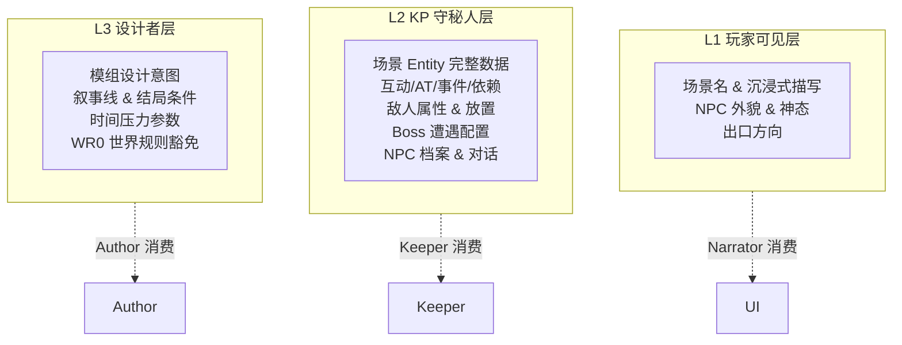

# TRPG 调查员助手 — 设计文档

> 面向开发者的架构原理与代码编写指引。
> 最后更新：2026-05-31

---

## 1. 核心设计理念

### 1.1 确定性 + LLM 混合（Deterministic-LLM Hybrid）

项目的根本原则：**主要硬性规则由确定性代码执行，edge-case和部分难以用确定性逻辑处理的规则和叙事与意图判定由 LLM 承担**

| 层 | 执行者 | 示例 |
|----|--------|------|
| 硬性规则 | 纯 Python | D100 检定、伤害公式、护甲减免、时间条件检查、AND/OR 依赖解析 |
| 叙事生成 | LLM | Keeper Enrich 叙事整合、Narrator 沉浸式描写、Author 动态扩展 |
| 意图判定 | LLM (flash) | Parse 实体匹配、Combat Entry 触发判定、Standoff 语义匹配 |
| 增强规则 | LLM (flash) | 调查员背景为行动带来的优势、武器的特殊规则 |

**为什么这样设计？** LLM 擅长语义理解但不擅长数值精确性。如果让 LLM 掷骰、计算伤害、判定 HP 归零，会产生不可预期的行为。将数值逻辑锁在 Python 中，LLM 只接收结构化数据并生成文本，保证了游戏规则的可预测性与一致性。

### 1.2 闭世界假设（Closed-World Hypothesis）

玩家可执行的动作由模组预设的 **Entity**（实体）界定。Entity 分为三类：

- **Interaction**（场景交互）：场景中预设的调查/检定/对话/决策节点
- **Auto-Trigger**（场景自动触发）：条件满足时自动执行
- **Event**（全局事件）：跨场景的全局触发

未匹配任何 Entity 的输入走三类兜底路径：
- `move` → 场景移动
- `search` → 通用侦查检定
- `other` → IntentDetector → Author 判断是否需要动态扩展

### 1.3 Agent 层封装（Agent Encapsulation）

**Keeper 不是传统意义上的单一 Agent**，而是一层 Agent 集合的编排封装。内部持有：
- `Judge`（确定性）— 检定/条件检查
- `Curator`（确定性）— 策展
- `IntentDetector`（LLM flash）— 叙事意图判定
- `PreParseDisambiguator`（LLM flash）— 消歧网关
- `CombatSystem`（独立引擎）— 回合制战斗

通过 `ThreadPoolExecutor` 并行编排 enrich / combat_entry / TimeAgent 三个 LLM 调用。对外只暴露 `process_turn()` 一个入口。

### 1.4 消息合约驱动（Dataclass Contract）

所有 Agent 间通信通过 `src/game/messages.py` 中定义的 dataclass 进行。组件不感知其他组件的内部实现，只依赖消息结构：

```
Player Input → TurnInput
                 ↓
Keeper.process_turn()
    ├─ Parse:     str → list[dict]
    ├─ Judge:     entity → ActionIntent → ActionOutcome
    ├─ Enrich:    EnrichInput → dict
    ├─ Curator:   list[ActionOutcome] → NarratorBrief
    └─ Narrator:  NarratorBrief → str (narrative)
```

### 1.5 输出管线分离

`skill_detail`（D100 骰值/检定结果）走独立管线，不经过 Narrator 叙事润色——"叙事者只叙事，不做裁判"。审判结果直接以 JSON 字段形式传递给前端，前端自行渲染技能检定标签。

---

## 2. 系统架构总览

```
┌─────────────────────────────────────────────────────┐
│                   离线创作管线                        │
│  .docx/.txt → Step 0(1次LLM) → Step 1-4(12次LLM)   │
│                                  ↓                  │
│                    L1 / L2 / L3 JSON                │
└──────────────────────┬──────────────────────────────┘
                       │ 运行时加载
┌──────────────────────▼──────────────────────────────┐
│                   运行时引擎                          │
│                                                      │
│  ┌─────────┐   ┌─────────┐   ┌──────────┐          │
│  │ 玩家输入 │ → │ Keeper  │ → │ Narrator │ → 输出    │
│  └─────────┘   │ Agent层 │   │  叙事    │           │
│                │  封装   │   └──────────┘           │
│                └────┬────┘                          │
│           ┌─────────┼─────────┐                     │
│           │         │         │                     │
│      ┌────▼──┐ ┌───▼───┐ ┌───▼────┐               │
│      │ Judge │ │Author │ │Combat  │               │
│      │ 确定性│ │ 动态  │ │System  │               │
│      └───────┘ │ 创作  │ └────────┘               │
│                └───────┘                            │
│                                                      │
│  ┌─────────────────────────────────────┐            │
│  │ 基础架构                              │            │
│  │ GameClock | EnemyManager | NPCManager |          │
│  │ BossManager | MemoryManager | Monitor |          │
│  └─────────────────────────────────────┘            │
└─────────────────────────────────────────────────────┘
```

### 2.1 模块边界

| 模块 | 路径 | 依赖 LLM | 依赖其他模块 | 可独立测试 |
|------|------|----------|-------------|-----------|
| GameClock | `game/clock.py` | 否 | 无 | 是 |
| EnemyManager | `game/enemy_manager.py` | 否 | EnemyLibrary | 是 |
| NPCManager | `game/npc_manager.py` | 是（对话） | 无 | 是 |
| BossManager | `game/boss_manager.py` | 否 | BossLibrary | 是 |
| Judge | `game/judge.py` | 是（失败惩罚/特质增强） | ScenarioWorld | 部分 |
| Curator | `game/curator.py` | 否 | ScenarioWorld | 是 |
| CombatSystem | `game/combat.py` | 是（回合叙事修正） | WeaponLibrary | 是 |
| IntentDetector | `game/intent_detector.py` | 是（flash） | 无 | 是 |
| PreParseDisambiguator | `game/pre_parse.py` | 是（flash） | 无 | 是 |
| SideEffects | `game/side_effects.py` | 否 | 无 | 是 |
| Monitor | `monitor/` | 否 | LLMSensor | 是 |
| Investigator | `investigator/` | 否 | 无 | 是 |
| Keeper | `game/agents/keeper.py` | 是 | 上述全部 | 集成 |
| Narrator | `game/agents/narrator.py` | 是 | 无 | 集成 |
| Author | `game/agents/author.py` | 是 | 无 | 集成 |
| TimeAgent | `game/agents/time_agent.py` | 是（flash） | 无 | 集成 |

---

## 3. 三层信息架构



### 3.1 L1 — 玩家可见层

数据结构（`l1.json`）：

```python
# 每个场景一个条目
{
  "场景名": {
    "name": "场景名",
    "description": "第三人称沉浸式描写...",
    "npcs": [
      {"name": "NPC名", "brief": "外貌简述", "demeanor": "当前神态"}
    ]
  }
}
```

- **拥有者**：Narrator
- **作用**：提供场景初始感知信息，供 Narrator 在叙事时注入氛围描写
- **运行时更新**：Author 通过 `StructuralEdit → supplement_pipeline` 可生成新的 L1 条目

### 3.2 L2 — KP 守秘人层

数据结构（`l2.json`）：

```python
{
  "module_meta": {"comms_interval": 15, ...},
  "scenes": {
    "场景名": {
      "description": "...",
      "from_here": [{"target": "目标", "method": "方式", "requirement": "条件"}],
      "to_here": [...],
      "interactions": [Entity, ...],
      "auto_triggers": [Entity, ...],
      "encounters": [...],
      "scene_weapons": [...]
    }
  },
  "events": [Entity, ...],
  "npc_profiles": {...},
  "boss_encounters": [...],
  "dependency_graph": {"nodes": {...}, "edges": [...]},
  "_scene_names": {"S1": "中文名", ...},  // 管线注入
  "_phase1": {...}  // 管线原始数据（Step 1a 输出）
}
```

- **拥有者**：Keeper
- **作用**：完整的场景/互动/事件/AT/NPC/敌人/Boss 数据，运行时由 `ScenarioWorld` 消费
- **`_scene_names`**：管线 Phase 2 注入的 S1→中文名映射。解决 L2 内部 ID 与中文场景名的不一致

### 3.3 L3 — 设计者层

数据结构（`l3.json`）：

```python
{
  "world_rules": [{"rule": "规则描述"}, ...],
  "story_threads": [{"name": "叙事线", "description": "..."}, ...],
  "time_pressure": {
    "name": "时间压力名",
    "guide": "压力引导",
    "urgency": 0,
    "urgency_max": 10,
    "key_signals": ["信号1", "信号2"]
  },
  "ending_conditions": [
    {"id": "END_1", "name": "结局名", "narrative": "结局叙事", "trigger": "触发条件"}
  ],
  "supplement_notes": "..."
}
```

- **拥有者**：Author
- **作用**：模组设计意图、叙事线、时间压力、结局条件
- **WR0**：开启后 Author 的 Patch/StructuralEdit 不受 `world_rules` 约束

---

## 4. 核心数据结构

### 4.1 Entity（统一实体）

`src/scenario_core.py:81-99`

```python
@dataclass
class Entity:
    id: str              # "I1", "AT2", "E3"
    entity_type: str     # "interaction" | "auto_trigger" | "event"
    name: str
    scene: str = ""      # 所属场景（event 为空）
    type: str = ""       # COC 45 技能名，"" = 无需检定
    requirement: str = ""  # "I1 AND I2" || "自然语言软条件"
    trigger: str = ""    # 触发条件描述（LLM 提示用）
    result: str = ""     # "##GRADED##" 或纯文本结果 + @markup
    side_effects: list[str] = field(default_factory=list)
    graded_result: dict | None = None  # {"on_regular": "...", "on_failure": "..."}
    difficulty: str = ""  # "" | "regular" | "hard" | "extreme"
    extra: dict | None = None  # {"time_range": {"min": 5, "max": 15}, ...}
    time_condition: str = ""  # JSON: [{"day":">=2","times":["夜间"]}]
```

### 4.2 Requirement 字符串语法

硬性条件（`requirement` 中 `||` 之前的部分）：

```
I1 AND (I2a OR I2b) AND E1
```

- `AND` 分组：所有分组必须满足
- `OR` 分组：任一组满足即可
- Entity ID（`I1`, `AT2`, `E3`）由 `parse_hard_requirement()` 解析
- 不含有效 Entity ID 的分组自动通过（graceful degradation for LLM-generated text）
- 特殊值 `NEVER_TRIGGER`：永远不满足

软性条件（`||` 之后的部分）：自然语言，由 Parse（LLM）评估是否满足。

### 4.3 NodeRuntimeState

`src/scenario_core.py:246-251`

```python
@dataclass
class NodeRuntimeState:
    completed: bool = False
    result_tier: str = ""          # "fumble" | "failure" | "regular" | "hard" | "extreme"
    retries: int = 0
    escalated_difficulty: str = "" # "hard" | "extreme"
```

每个 Entity ID 对应一份运行时状态。由 Judge 写入，由 RequirementResolver 和 Enrich prompt 构建器读取。

### 4.4 消息合约一览

`src/game/messages.py` — 所有 Agent 间通信的 dataclass：

| Dataclass | 发送方 | 接收方 | 用途 |
|-----------|--------|--------|------|
| `TurnInput` | game_loop | Keeper | 回合入口 |
| `ActionIntent` | Parse | Judge | 解析出的意图 |
| `ActionOutcome` | Judge | Curator | 单个 action 的结果 |
| `NarratorBrief` | Curator | Narrator | 策展结果 |
| `PlayerFacingSnapshot` | game_loop | 前端/CLI | 回合输出 |
| `AuthorRequest` | IntentDetector | Author | 玩家叙事意图 |
| `ModulePatch` | Author | Keeper | entity 补丁 |
| `StructuralEdit` | Author | Keeper | 结构扩展 |
| `CombatEntryCheck` | LLM | Keeper | 战斗触发判定 |
| `CombatInit` | Keeper | CombatSystem | 战斗初始化 |
| `CombatResult` | CombatSystem | Keeper | 战斗结果 |
| `StandoffMatch` | LLM | Keeper | 对峙语义匹配 |
| `EnrichInput` | Keeper | Keeper | Parse→Enrich 中间结构 |
| `TimeCommsPacket` | Keeper | Author | 时间压力通信 |
| `PreParseResult` | PreParse | Keeper | 消歧结果 |
| `SkillCheckResult` | game_loop | PlayerFacingSnapshot | 单次检定结果 |
| `RoundResult` | CombatSystem | CombatSystem | 单战斗轮结果 |

---

## 5. 回合管线 — 完整数据流

### 5.1 process_turn() 全流程

`src/game/agents/keeper.py:78-917`

```
player_input (str)
    │
    ▼
Step 0: PreParseDisambiguator (LLM flash)
    ├─ clarity="ambiguous" → 返回反问引导 → 短路
    └─ clarity="clear" → resolved_text 可能有跨回合整合 → 继续
    │
    ▼
Step 0.5: _inject_npc_at() (确定性)
    └─ 将当前场景 NPC 的 bound_interactions + bound_auto_triggers
       注入到 node（条件满足的、未完成的、不重复的）
    │
    ▼
Step 1: Parse (LLM flash, is_critical=true)
    ├─ 匹配 interaction / auto_trigger / event / move / search / other
    ├─ npc_interact → 走 NPC 对话管道 → 短路返回
    └─ IntentDetector 异步启动（如有 "other" 条目）
    │
    ▼
Step 2: Judge (确定性 + LLM)
    对每个 entity:
    ├─ time_condition 检查 → 不满足跳过
    ├─ requirement 硬条件检查 → parse_hard_requirement()
    ├─ D100 技能检定 → check_skill()
    ├─ trait_enhancement (LLM) → 特质修正
    ├─ resolve_graded_result() → ##GRADED## 分辨率
    ├─ @markup 解析 → parse_markup_all()
    └─ 失败惩罚（≥3次） → evaluate_failure_penalty(LLM)
    │
    ▼
Step 2.5: Combat entry 判定 (LLM flash)
    ├─ enemy_ctx = get_combat_context() → LLM 判断是否进入战斗
    ├─ avoidable 敌人 → 构造对峙 state
    └─ hostile 敌人 → 构造 CombatInit
    │
    ▼
Step 2.6: Boss "at"/"interaction" 检查 (确定性)
    ├─ check_by_engage_type("at" / "interaction")
    └─ 合并到 CombatInit（已有普通敌人时不覆盖）
    │
    ▼
Step 3: [Enrich (LLM flash) ∥ TimeAgent (LLM flash)] (ThreadPoolExecutor 并行)
    ├─ Enrich: 整合所有 entity 结果为统一叙事
    └─ TimeAgent: 评估本轮耗时 → clock.advance_time()
    │
    ▼
Step 3.5: TimePressure 通信 (LLM flash, 每 comms_interval 游戏分钟最多 1 次)
    └─ TimeCommsPacket → author.assess_time_pressure()
    │
    ▼
Step 4: IntentDetector 决策点
    └─ 如有 "other" 且 needs_author:
        ├─ Patch → _integrate_patch() → 递归 process_turn()
        ├─ StructuralEdit → _integrate_supplement() → 递归
        └─ Reject → 注入叙事提示
    │
    ▼
Step 4.5: _apply_pending() (确定性)
    ├─ 执行延期 move
    ├─ 执行延期 side_effects
    └─ 注入跟随 NPC 的 EVT_NPC_FOLLOW
    │
    ▼
Step 5: Curate (确定性, is_critical=true)
    └─ outcomes + ambient → Curator.assemble() → NarratorBrief
    │
    ▼
Step 6: Memory 压缩 (后台线程, LLM flash, best-effort)
    └─ memory.should_compress() → background Thread
    │
    ▼
Return {brief, combat_init, standoff_prompt, ending, time_agent, npc_events, ...}
```

### 5.2 game_loop 后处理

`src/game_loop.py:272-499`

```
result = keeper.process_turn(turn_input, author)
    │
    ├─ skill_results 提取 (从 ActionOutcome)
    ├─ narrator.narrate(brief) → narrative_brief, narrative, scene_update
    ├─ PlayerFacingSnapshot 构建:
    │   ├─ scene_name / scene_description (L1优先)
    │   ├─ exits / time / npcs / enemies / combat / skill_checks
    │   └─ investigator 对象（前端读取 weapons / items）
    ├─ 武器拾取提示注入
    └─ Return {brief, narrative, full, player_snapshot, skill_results, combat, ...}
```

### 5.3 前端回合流程

```
用户输入 → sendTurn() → POST /api/game/turn
    ├─ "/" 开头 → _handle_slash_command()
    └─ 否则 → run_turn() → JSON response
        → handleTurnResponse():
            ├─ updateSceneCard(snap)  → 更新场景信息卡
            ├─ 构建 .turn-card (combat/skills/brief/narrative)
            └─ fetch /api/game/player-status → updateCharHUD()
```

---

## 6. Agent 协作模型

### 6.1 Agent 关系图

```
                           Author
                          /       \
                    L3数据        Patch/StructuralEdit
                        /           \
    Player → Keeper ──→ IntentDetector
       ↑       │              │
       │       ├── Judge ─────┤
       │       ├── Curator ───┤
       │       ├── PreParse ──┤
       │       ├── CombatSystem (独立引擎)
       │       └── TimeAgent ──→ Clock
       │              │
       └── Narrator ←─┘
              │
              ▼
         玩家输出
```

### 6.2 Keeper 编排模式

Keeper 内部使用 **6 步编排模式**：

```python
def process_turn(self, turn_input, author):
    # Step 0: Pre-parse gate
    # Step 1: Parse (LLM) + IntentDetector async
    # Step 2: Judge (deterministic) per entity
    # Step 3: [Enrich ∥ TimeAgent] parallel
    # Step 4: Author escalation (if IntentDetector says yes)
    # Step 5: Curate (deterministic)
    # Step 6: Memory compression (background)
```

关键设计决策：
- **Step 0 的消歧网关前置**：避免错误 Parse 导致后续步骤浪费 LLM 调用
- **IntentDetector 异步启动**：在 Step 1 Parse 完成后立即启动，与 Step 2 Judge 并行
- **Enrich ∥ TimeAgent 并行**：两个 LLM 调用无依赖关系
- **Author 后于 Judge**：确保只有确定性执行通过后才进入动态创作，防止 LLM 幻觉污染世界状态
- **延期执行模式**：side_effects 和 move 在 Author 检查通过后才执行，保证 Author Reject 时世界不变

### 6.3 PreParseDisambiguator — 消歧网关

`src/game/pre_parse.py`

一个专用轻量 Agent，在 Parse 之前跑。解决 LLM Parse 的最大痛点：模糊输入匹配到无关 entity。

```
玩家输入："搜一下"
    ↓
PreParseDisambiguator.disambiguate()
    ├─ 检查上下文缓冲（上一回合的预解析结果）
    ├─ clarity="ambiguous" → question="你要搜查什么？比如：'搜查抽屉'、'搜查床底'"
    │   → Keeper 短路返回反问
    └─ clarity="clear" → resolved_text="搜查抽屉"（跨回合整合）
```

- **上下文整合**：如果上一回合玩家说"我想看看抽屉"，本回合说"搜一下"，整合为"搜查抽屉"
- **连续模糊兜底**：连续 2 次 ambiguous 后自动执行（防止死循环）

### 6.4 TimeAgent 与 TimePressure 分离

这是两个独立的时间相关机制：

| 机制 | 触发 | 职责 | 消费方 |
|------|------|------|--------|
| TimeAgent | 每回合（与 Enrich 并行） | 评估本轮耗时（分钟） | GameClock |
| TimePressure | 每 `comms_interval` 游戏分钟 | 判断时间压力是否需要叙事体现 | Author |

```python
# TimeAgent (keeper.py:671-732)
ta_result = self._run_time_agent(enrich_input.actions, raw)
if ta_result.get("time_delta", 0) > 0:
    self.world.clock.advance_time(ta_result["time_delta"])

# TimePressure (keeper.py:734-769)
if tp and self.world.clock.game_time - self._last_comms_time >= self.world.comms_interval:
    self._last_comms_time = self.world.clock.game_time
    tp_result = author.assess_time_pressure(packet)
    if tp_result.get("should_press"):
        # 注入时间压力叙事到 enrich_input
```

### 6.5 Author 两级响应

`src/game/agents/author.py:43-92`

| 级别 | 返回类型 | 触发条件 | 处理方式 |
|------|----------|----------|----------|
| **Patch** | `ModulePatch` | 玩家行为在已有场景内但缺 entity | 向当前场景注入新 entity → 递归 process_turn() |
| **Reject** | `ModulePatch(entities=[])` | 玩家行为不合理/违背剧情线 | 注入拒绝叙事 → 继续正常流程 |
| **StructuralEdit** | `StructuralEdit` | 玩家行为超出已有场景范围 | 触发 supplement_pipeline → 合并新场景/entity/L1/L3 → 递归 |

`MAX_ESCALATION_DEPTH = 3`（`config.py`）：Author 递归上限。超限后走 `_process_deterministic_only()` 纯确定性通道。

---

## 7. 确定性子系统

### 7.1 GameClock — 分钟计时器

`src/game/clock.py` — 57 行，纯确定性。

```python
class GameClock:
    game_time: int = 0  # 累计游戏分钟数

    @property
    def day(self) -> int:        # game_time // 1440
    @property
    def hour(self) -> int:       # (game_time % 1440) // 60
    @property
    def time_of_day(self) -> str:  # 5 段：<5 夜间, <8 早晨, <17 白天, <20 黄昏, ≥20 夜间

    def advance_time(self, minutes: int):
        self.game_time += minutes
        # 自动注入 time flags 到 runtime_state
        for flag, value in self.get_time_flags().items():
            state = world.get_runtime_state(flag)
            state.completed = value
```

**time flags 自动注入**：`advance_time()` 后自动将 `day:N:True`、`time:时间段:True` 写入 `runtime_state`。Entity 的 `time_condition` 通过 `check_time_condition()` 检查这些 flags。

### 7.2 Judge — 确定性闸门

`src/game/judge.py:30-388`

核心方法 `_execute_entity(entity, intent, player_input)` 的执行流程：

```
1. requirement 硬条件检查 → parse_hard_requirement() → AND/OR 解析
2. time_condition 检查 → check_time_condition()
3. escalated_difficulty 应用 → 失败过的 entity 难度永久提升一级
4. D100 技能检定 → player.check_skill(skill_name, difficulty)
5. trait_enhancement (LLM) → 特质描述匹配技能，可能升/降 tier
6. resolve_graded_result() → ##GRADED## → 分 tier 叙事
7. 失败惩罚（≥3 次重试） → evaluate_failure_penalty(LLM) → 创意惩罚
8. @markup 解析 → parse_markup_all() → 副作用列表
9. completion flag → mark_completed(entity_id, tier)
```

**失败惩罚递增机制**（`judge.py:173-225`）：

| 失败次数 | 触发 | 说明 |
|----------|------|------|
| 第 1 次 | `_escalate_difficulty()` | 难度升一级写入 `NodeRuntimeState` |
| 第 2 次 | `state.retries++` | 仅递增计数 |
| 第 3+ 次 | `evaluate_failure_penalty(LLM)` | 生成扣 HP/SAN/刷怪/NPC 敌对等创意惩罚 |

### 7.3 Curator — 策展器

`src/game/curator.py` — 54 行，纯确定性。

将 `ActionOutcome` 列表 → `NarratorBrief`。功能：
- 组合检定结果 + 环境变化 + 场景快照
- 过滤仅 player-perceptible 的信息
- 生成叙事方向提示（emphasis）

### 7.4 SideEffects — @markup 系统

`src/game/side_effects.py` — 8 种 @markup dataclass + `parse_markup()` / `parse_markup_all()` 解析器。

| Dataclass | @markup | 应用路径 |
|-----------|---------|----------|
| `SpawnEnemy` | `@spawn_enemy(enemy_ref="", scene="", quantity=1)` | `EnemyManager.spawn()` |
| `GrantWeapon` | `@grant_weapon(weapon_ref="", scene="", quantity=1)` | `scene_weapons` 放置 或 直接授予 |
| `StatChange` | `@stat_change(stat_name="", delta=-1, narrative="")` | `Investigator.modify_stat()` + LLM 描述更新 |
| `ItemGain` | `@item_gain(item_name="", quantity=1)` | `ItemManager.add()` |
| `ConsumeItem` | `@consume_item(item_name="", quantity=1)` | `ItemManager.remove()` + LLM 模糊匹配保底 |
| `NPCStateChange` | `@npc_state_change(npc_name="", new_state="")` | `NPCManager.set_state()` |
| `NPCFollow` | `@npc_follow(npc_name="", follow=true/false)` | `NPCManager.set_following()` |
| `@grant_spell` | 法术授予（U9 预留） | 暂未实现 |

**解析规则**：`parse_markup_all(text)` 从文本中提取所有 `@函数名(key=value, ...)` 模式，参数为 Python eval 格式。

### 7.5 Dependency Graph — 依赖图

`src/module_designer/dependency_graph.py` + `src/scenario_core.py:762-836`

运行时消费：

```python
# 检查 entity 的所有前置依赖是否满足
world.check_edge_requirements(entity_id) → (met: bool, reason: str)

# 自动触发：依赖满足时 fire
for edge in dep_graph["edges"]:
    if edge["dep_type"] == "interaction":
        if world.is_entity_completed(edge["target"]):
            # fire edge["source"] event
```

循环检测在管线 Step 3.5 执行，cut edge 在运行时禁用。

---

## 8. LLM 集成合约

### 8.1 call_deepseek() 统一入口

`src/llm.py:274-490`

```python
def call_deepseek(
    prompt: str,
    *,
    json_mode: bool = False,      # True → temperature=0.2
    system: str = "",              # system prompt
    model: str = "deepseek-v4-pro",
    thinking: bool = True,         # DeepSeek reasoning
    reasoning_effort: str = "high",
    fallback_schema: dict = None,  # JSON parse 失败时的保底输出
) -> str | dict
```

**关键约定**：
- `json_mode=True` → temperature=0.2, response_format={"type": "json_object"}
- `json_mode=False` → temperature=0.7（叙事生成）
- `fallback_schema` → JSON 解析失败时返回该 schema + log warning
- `thinking` 和 `reasoning_effort` 可按需降级（flash 模型通常不传 thinking）
- `_label` 参数用于 LLMSensor 记录调用统计

### 8.2 Prompt 构建器

`src/prompts.py` — ~1060 行，所有 Agent 的 prompt 构建在此集中管理。

每位 Agent 的 system prompt 可在 `config.py:AGENT_SYSTEM_PROMPTS` 中覆盖：

```python
AGENT_SYSTEM_PROMPTS = {
    "keeper_parse": "",      # 留空 = 用内置默认
    "narrator": "自定义 system prompt...",
}
```

### 8.3 AgentMonitor 包装

所有 Agent 的 LLM 调用通过 `AgentMonitor.call()` 包装，而非直接调用 `call_deepseek()`：

```python
class Keeper:
    def __init__(self, world):
        self.monitor = AgentMonitor("Keeper", sensor, KeeperPolicy())

    def _parse(self, raw):
        return self.monitor.call(
            lambda p, **kw: call_deepseek(p, _label="keeper_parse", **kw),
            prompt, json_mode=True, model=LLM_FLASH_MODEL,
        )
```

优势：自动记录调用统计 + 自动降级决策 + 自动恢复。

---

## 9. 战斗系统架构

`src/game/combat.py` — Combat v2 群组模型。完整文档见 `docs/combat-system-v2.md`。

### 9.1 群组模型

所有敌人以**群组(group)**为单位管理，三元组 `(scene, enemy_ref)` 为唯一键：

```
spawn(enemy_ref, scene, quantity)
  → 已存在群组 → quantity 叠加，HP 重新计算
  → 新群组 → 创建

_init_combat()  展开 quantity > 1 的群组为独立实体
exit_combat()   outcome 驱动 — win → 群组 status="defeated"，非 win → 恢复 "hostile"
```

- **ID 生命周期**：展开后的 `_c0`/`_c1` 后缀 ID 仅用于战斗过程，战后丢弃不映射
- **≥5 敌人**：CombatInit 自动截断到 5，打赢 → 全部群组 defeat，不考虑 partial survival

### 9.2 入口与退出

```
Keeper.process_turn()
    ├─ Step 2.5: CombatEntryCheck → enter_combat = true → CombatInit
    ├─ Step 2.6: Boss "at"/"interaction" → 合并到已有 CombatInit（不覆盖）
    └─ Step 5: Boss "event" → CombatInit

game_loop.run_turn()
    └─ if combat_init:
        ├─ CLI: _run_interactive_combat() (每轮玩家选择动作)
        └─ 前端: CombatSystem.run_combat() (自动战斗)

exit_combat({"outcome"})
    ├─ win → 全部 _combat_enemies 群组 → status="defeated"
    ├─ loss/flee/draw → 恢复 "hostile"，不清理
    └─ HP/SAN 回写到 player.derived
```

### 9.2 核心类

| 类 | 职责 |
|----|------|
| `CombatState` | 可变状态：round / enemies / player_hp / initiative_order / log / full_log |
| `CombatAction` | 单次动作记录：actor / action_type / weapon / skill / roll / tier / damage |
| `CombatSystem` | 控制器：逐轮编排 + D100 检定 + 伤害公式 + LLM 修正 |

### 9.3 LLM 双 Agent 回合修正

Combat v2 引入双 Agent 修正机制：

```
_resolve_player_action() → 确定性结果 (damage, tier, success)
    ↓
_llm_correct_round() → LLM: "玩家动作结果的叙事修正"
    ↓ (可能改写 damage/tier/effects)
_resolve_enemy_action() → 确定性结果
    ↓
_llm_correct_enemy_round() → LLM: "敌人动作结果的叙事修正"
    ↓
结算修正后伤害 → 存活判定
```

**为什么双 Agent？** 玩家和敌人的叙事语境差异大（玩家是主动方，敌人是被动方），分开修正避免了 prompt 混淆。

### 9.4 Boss 战斗分流

| 类型 | 进入方式 | 失败后果 |
|------|----------|----------|
| 普通战斗 | Combat Entry Detection | loss → game_over=True，游戏结束 |
| Boss 战斗 | BossManager "at"/"interaction"/"event" | loss → game_over=False，不强制结束 |

**Boss 判定**：只要 `CombatInit.enemies` 中存在 `boss_mechanics != ""` 的敌人，或有 `world.bosses.active_boss_id`，即为 Boss 战斗。

Boss 支持 phase 机制（`hp_below_pct` / `round` 触发），同一 Boss 可多次遭遇。

### 9.5 战斗系统改动对比

| 特性 | v1 (已废弃) | v2 (当前) |
|------|-----------|----------|
| 敌人管理 | 逐实例追踪 | 按 `(scene, enemy_ref)` 群组管理 |
| 战后状态 | "dead" | "defeated" |
| 战后清理 | 基于 defeated_instance_ids 精确匹配 | outcome 驱动（win → 全部 defeat） |
| Boss 覆盖 | Boss 战斗覆盖普通战斗 | Boss 合并到已有 CombatInit |
| 数量处理 | quantity 仅影响群组总 HP | quantity 展开为独立实体，各自战斗 |
| ≥5 敌人 | 保留 5 个，其余存活 | 保留 5 个，打赢 → 全部 defeat |
| 战斗日志 | JSON 格式 | 可读文本 `.txt` + LLM prompt/response 归档 |

### 9.6 对峙系统
    1. 语义匹配(LLM flash): 玩家输入 → 技能名
    2. D100 检定: check_skill(skill_name, "regular")
    3. trait_enhancement(LLM)
    4. 结果:
       ├─ 成功 → 敌人转 neutral / 潜行绕过
       └─ 失败 → 敌人转 hostile → 进入战斗
```

支持多群组对峙：`avoidable_by_ref` 分组处理，每个群组一次机会。

---

## 10. 监控与韧性

### 10.1 三层监控体系

`src/monitor/`

```
LLMSensor ──→ AgentMonitor ──→ TurnMonitor
  ↑ 记录调用      ↑ 降级决策        ↑ 回合状态机
```

### 10.2 LLMSensor

- 环形缓冲（`MONITOR_HISTORY_SIZE = 200`）
- 按 `_label` 分组统计（`get_stats(agent_name)`）
- `consecutive_failures` / `recent_slow_rate` 实时计算

### 10.3 AgentMonitor 降级策略

每个 Agent 独立降级。触发条件：
- 连续失败 ≥ 3 → 降级
- 近期慢调用率 ≥ 0.5 → 预防性降级

降级后行为（按 Agent 不同）：
- Keeper：切换到 flash 模型 + 跳过 enrich/combat_entry/intent_detect
- Narrator：切换到 flash + 关闭 thinking + low reasoning_effort
- TimeAgent：完全跳过
- Author：拒绝 StructuralEdit（仅接受 Patch/Reject）

恢复：累计 5 次连续成功 → 自动恢复正常。

### 10.4 TurnMonitor 回合保护

每回合 `begin_turn()` 自动保存世界状态 snapshot。关键步骤（parse/curate）失败耗尽重试后：

1. 恢复世界状态到上回合 snapshot
2. 保存 `data/autosave/recovery.json`
3. 抛出 `TurnFrozenError` → 通知玩家 `/load recovery`

### 10.5 自动存档

`game_loop.py:538-580`

- 定时器（默认 600s）置标志位
- `run_turn()` 入口检查 → 执行 `save_game()` → 写入 `autosave_1.json` ~ `autosave_5.json`
- 内容 = 全量世界状态快照（graph + world + memory + player + turn_number）

---

## 11. 扩展点

### 11.1 新增 Agent

1. 实现 Agent 类，持有 `AgentMonitor` 实例
2. 在 `game/messages.py` 中定义通信 dataclass
3. 在 `prompts.py` 中添加 prompt 构建函数
4. 在 Keeper 相应步骤调用
5. 在 `config.py:DEGRADE_POLICY` 中添加降级策略

### 11.2 新增 Subsystem

1. 在 `game/` 下创建独立模块
2. 确保通过 dataclass 合约与 Keeper 通信
3. 在 `ScenarioWorld.__init__()` 中初始化
4. 在 `ScenarioWorld.to_dict()` / `from_dict()` 中实现序列化
5. 编写独立单元测试（不依赖 LLM）

### 11.3 新增 LLM Provider

`src/llm.py:call_deepseek()` 是唯一 LLM 入口。要切换 Provider：
1. 实现新的 `call_xxx()` 函数，签名与 `call_deepseek()` 一致
2. 或修改 `call_deepseek()` 内部 dispatch

### 11.4 新增 @markup Side Effect

1. 在 `game/side_effects.py` 中定义新 dataclass
2. 更新 `parse_markup()` 的模式匹配
3. 在 `keeper.py:_apply_side_effects()` 中添加处理分支
4. 更新 `scenario_core.py:_side_effect_to_dict()` 序列化

### 11.5 模组管线步骤扩展

管线步骤在 `module_designer/layered_pipeline.py:run_pipeline()` 中顺序定义。新增步骤：
1. 实现 prompt 构建 + 解析函数
2. 在 `run_pipeline()` 中插入调用
3. 实现 `_fallback` 保底策略
4. 在 `layered_schema.py` 中更新 JSON Schema（如影响输出结构）

---

## 12. 配置系统

`src/config.py` — 集中化配置，不含敏感信息。

### 结构

```python
# 子系统开关
WR0_ENABLED = False

# 监控阈值
LLM_SLOW_THRESHOLD_MS = 8000
LLM_MAX_CONSECUTIVE_FAILURES = 3
LLM_DEGRADE_RECOVERY_COUNT = 5

# 降级策略
DEGRADE_POLICY: dict[str, dict] = {...}

# 游戏循环
MAX_ESCALATION_DEPTH = 3
COMMS_INTERVAL_MINUTES = 15

# Agent 系统提示词覆盖
AGENT_SYSTEM_PROMPTS = {"keeper_parse": "", ...}
```

### 配置读取约定

- 所有硬编码从 `config.py` 读取，不在业务代码中写魔法数字
- `AGENT_SYSTEM_PROMPTS` 留空 = 使用 Agent 内建默认值
- 新增配置项：先添加默认值，再在使用处导入

---

## 13. 代码导航速查

### 13.1 我想改什么 → 去哪里找

| 我想改... | 文件 | 找什么 |
|-----------|------|--------|
| 回合逻辑 | `src/game_loop.py` | `run_turn()` / `init_game()` |
| Parse 逻辑 | `src/game/agents/keeper.py` | `_parse()` |
| 检定逻辑 | `src/game/judge.py` | `_execute_entity()` |
| 敌人管理 | `src/game/enemy_manager.py` | `spawn()` / `get_combat_context()` |
| NPC 对话 | `src/game/npc_manager.py` | `talk_to()` |
| 战斗系统 | `src/game/combat.py` | `CombatSystem.run_combat()` / `_run_interactive_combat()` |
| 战斗触发判定 | `src/game/agents/keeper.py:488-561` | Step 2.5 / Step 2.6 |
| 敌人管理 | `src/game/enemy_manager.py` | `spawn()` / `get_combat_context()` / `exit_combat()` |
| Author 动态创作 | `src/game/agents/author.py` | `handle_request()` |
| 叙事输出 | `src/game/agents/narrator.py` | `narrate()` |
| Prompt 构建 | `src/prompts.py` | 各 `build_*_prompt()` 函数 |
| LLM 调用 | `src/llm.py` | `call_deepseek()` |
| 前端路由 | `frontend/server.py` + `frontend/routers/` | FastAPI router |
| 前端游戏页 | `frontend/templates/game.html` | JS 函数 + DOM |
| 管线 | `src/module_designer/layered_pipeline.py` | `run_pipeline()` |
| 管线 Step 0 | `run_step0.py` | 独立脚本 |
| 配置开关 | `src/config.py` | 全局常量 |
| API 密钥 | `src/config_llm.py` | 模型/Key |
| 模组数据 | `data/modules/<name>/` | `.json` / `.txt` |
| 资源库 | `data/library/core/` | `enemies.json` / `weapons.json` / `bosses.json` / `templates.json` |
| 提取工具 | `scripts/extract_library.py` | 小说 → 标准库素材自动提取 |
| 测试 | `tests/` | 各 `test_*.py` |

### 13.2 关键常量与魔法数字

| 值 | 位置 | 含义 |
|----|------|------|
| `D100` | `investigator/rules.py` | COC 7th 检定机制 |
| `"regular"/"hard"/"extreme"` | `investigator/models.py:check_skill()` | ≤skill / ≤skill/2 / ≤skill/5 |
| `"##GRADED##"` | `scenario_core.py` | 分级结果占位符 |
| `"##END_name:desc##"` | `scenario_core.py` | 结局标记 |
| `"avoidable"` | `library/enemies.py` flag | 敌人可对峙绕过 |
| `"adjacent_aware"` | `library/enemies.py` flag | 敌人跨场景可感知 |
| `||` | requirement 字段 | 硬条件(左) ∥ 软条件(右) 分隔符 |
| `AND` / `OR` | requirement 硬部分 | 布尔逻辑解析 |

---

## 14. 与其他文档的关系

| 文档 | 内容 | 适用读者 |
|------|------|----------|
| `readme.md` | 用户/KP/开发者混合指南，快速上手 | 所有人 |
| `docs/design.md`（本文档） | 架构原理、设计决策、代码指引 | 开发者 |
| `docs/superpowers/guides/cookbook.md` | 逐模块代码导航与函数拆解 | 开发者 |
| `docs/combat-system-v2.md` | 战斗系统完整文档 | 开发者 |
| `docs/superpowers/specs/` | 各子系统设计 spec + plan | 开发者 |
| `docs/superpowers/guides/module-authoring-guide.md` | 模组创作指南 | 模组作者 |
