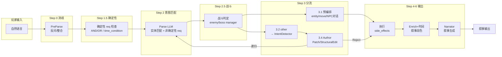
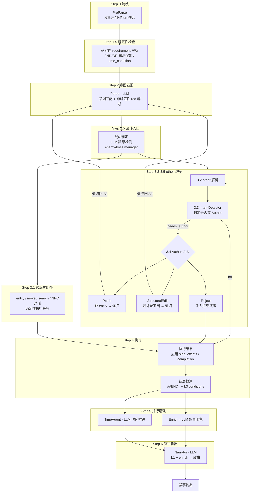

# TRPG 调查员助手

[]()
[]()
[]()
[]()

基于 LLM 的 TRPG（桌上角色扮演游戏）KP 助手，COC 7th 规则。从模组创作到游戏运行，提供完整的调用链与辅助工具。

> **项目状态**：当前仓库为**架构展示版本**，仅包含核心链路的代码抽象与非核心逻辑展示，**无法直接运行**。完整代码暂未开源，作者正在进行边界功能修补与软件著作权申请，预计 **2026 年 7 月 1 日之前**完成全量开源。

> **AI-Native 开发实践**：本项目约 **98% 的生产代码由 LLM 自动生成**(含单元测试)，约 **50% 的集成测试与日志审计**亦由大模型完成。作者主要负责需求分析、架构设计、提示词微调、方法论管理与测试补充验证。

---

## 架构总览

项目由**两条管线**构成：离线模组创作管线与在线游戏运行管线。

```
┌──────────────────────────────────────────────────────────────┐
│                    离线模组创作管线                          │
│                                                              │
│  小说/文档 ──→ Step 0: 转写为模组格式 ──→ 多步 LLM 解析      │
│                                              ↓               │
│                                  L1 / L2 / L3 三层 JSON      │
└──────────────────────────────────┬───────────────────────────┘
                                   │ 运行时加载
┌──────────────────────────────────▼───────────────────────────┐
│                    在线游戏运行管线                          │
│                                                              │
│  玩家输入 ──→ Keeper (编排层) ──→ Narrator (叙事层) ──→ 输出 │
│                  │                                            │
│            ┌─────┼─────┐                                      │
│         Judge  Author  CombatSystem                          │
│         (确定性) (动态创作) (战斗引擎)                        │
│                                                              │
│   基础架构: GameClock / EnemyManager / NPCManager /           │
│             BossManager / MemoryManager                       │
└──────────────────────────────────────────────────────────────┘
```

---

## 模组创作管线

将小说或叙事文本自动转化为可运行的 TRPG 模组，输出结构化的**三层 JSON**。

### 流程概览

```mermaid
flowchart LR
    subgraph Input[输入]
        doc[小说原文<br/>.docx / .txt / .pdf]
    end

    subgraph Step0[Step 0 · 小说→模组]
        direction LR
        S0[LLM 1次<br/>全文理解 + 模组转写]
    end

    subgraph Step1[Step 1 · 结构化提取]
        direction LR
        S1a[LLM JSON<br/>场景/角色/敌人/武器/元信息]:::json
        S1b[LLM 文本<br/>章节精炼]:::text
    end

    subgraph Step2[Step 2 · 三层构建]
        S2a[LLM JSON<br/>Interaction 提取<br/>场景通行路径]:::json
        S2bc[并行 3 路 LLM<br/>Events+AT / L1 玩家层 / L3 设计层]:::json
    end

    subgraph Step3[Step 3 · 关联与核查]
        S3a[LLM JSON<br/>去重冲突 + 实体归属<br/>NPC 档案绑定]:::json
        S3b[LLM JSON<br/>L1 ↔ L2 交叉核对<br/>gap-fill]:::json
    end

    subgraph Step35[Step 3.5 · 依赖图]
        S35[LLM JSON<br/>依赖图构建<br/>循环检测 + 切断]:::json
    end

    subgraph Phase2[Phase 2 · 标准化]
        P2[LLM JSON<br/>@标记标准化<br/>Schema 验证<br/>交叉引用校验]:::json
    end

    subgraph Output[输出]
        L1[L1 玩家层<br/>场景描写/NPC外貌]:::out
        L2[L2 KP 守秘人层<br/>实体/事件/NPC档案/依赖图]:::out
        L3[L3 设计者层<br/>世界规则/叙事线/结局条件]:::out
    end

    Input --> Step0
    Step0 --> Step1
    Step1 --> S1a
    Step1 --> S1b
    S1a & S1b --> S2a
    S2a --> S2bc
    S2bc --> S3a
    S3a --> S3b
    S3b --> S35
    S35 --> Phase2
    Phase2 --> L1
    Phase2 --> L2
    Phase2 --> L3

    classDef json fill:#e1f5fe,stroke:#0288d1
    classDef text fill:#fff3e0,stroke:#f57c00
    classDef out fill:#e8f5e9,stroke:#388e3c
```



**统计**：完整管线共约 13 次 LLM 调用（Step 0 × 1 + Step 1 × 2 + Step 2 × 4 + Step 3 × 2 + Step 3.5 × 1 + Phase 2 × 1 + Boss 补充 × 1），支持断点续跑和手动修改中间结果和全自动模式。

### 三层信息架构

| 层 | 拥有者 | 内容 | 运行时消费者 |
|----|--------|------|-------------|
| **L1 玩家层** | Narrator | 场景沉浸式描写、NPC 外貌神态、出口方向 | 叙事输出 |
| **L2 KP 守秘人层** | Keeper | Entity 完整数据、事件/AT、敌人/Boss 配置、NPC 档案、依赖图 | 回合编排 |
| **L3 设计者层** | Author | 世界规则、叙事线、时间压力、结局条件、创作者豁免(WR0) | 动态创作 |

三层分离的设计使得"玩家看到的内容"与"KP 使用的规则数据"和"创作者的意图"三者解耦，每层可独立演进。

### 小说→模组 Step 0 的设计约束

Step 0 是整个管线的入口，将小说文本转写为 TRPG 模组格式。核心原则：

- **模组的基本单位是"场景"和"选择"**，而非小说的"章节"和"描写"
- **每个场景都应提供调查员可做的事**：观察、搜索、互动、战斗、逃离
- **多分支剧情**：核心决策节点设计 2-4 个分支，最终汇聚到 2-3 个结局
- **叙事视角转换**：将"他感到""她想起"转化为"调查员可以察觉"的客观描述
- **合理补充**：原文缺失的内容可在模组中补充，标注"（模组补充）"以便 KP 识别

---

## 游戏运行架构

### 核心架构：3层-Agent 编排 

| Agent | 模型 | 职责 |
|-------|------|------|
| **Keeper（主控）** | Flash | 回合编排中枢，持有 Judge/Curator/CombatSystem 等确定性子系统 |
| **Narrator（叙事者）** | Flash | 将结构化结果转化为沉浸式叙事文本 |
| **Author（创作者）** | Pro + Flash | 动态扩展：当玩家行为超出预设时，动态生成新实体/场景 |

Keeper和Author本身是多agent封装层，核心特征是agent是否使用L2/L3层级的信息

### 单回合管线


<details>
<summary>展开完整管线图（含 requirement 解析阶段、entity/other 分流、Author 递归回路等细节）</summary>



</details>

</details>

### 设计理念

#### 确定性 + LLM 混合

项目的根本原则：**主要硬性规则由确定性代码执行，难以用确定性逻辑处理的边缘情况、叙事与意图判定由 LLM 承担**。LLM 擅长语义理解但不擅长数值精确性——让 LLM 掷骰、计算伤害、判定 HP 归零会产生不可预期的行为。将数值逻辑锁在 Python 中，LLM 只接收结构化数据并生成文本，保证了规则的可预测性与一致性。

此理念体现在两种典型编排范式中：

- **意图理解管线**：LLM 对玩家自然语言进行理解，分配至多种预设处理链路——部分使用确定性逻辑（Judge 的 D100 检定、requirement 条件解析），部分使用 LLM（CombatEntry 敌意判定、Enrich 叙事整合）——最后由 Curator（确定性）汇总策展，Narrator（LLM）生成最终叙事输出。
- **世界状态存储**：确定性 flag 标记已完成事件和依赖链解析，LLM 维护短期+长期记忆帮助叙事润色，同时存储难以被 flag 标识的非结构化信息。

#### 多 Agent + 结构化信息分配

通过**三层信息架构**（L1 玩家层 / L2 KP 守秘人层 / L3 设计层）搭配多个 Agent，实现"单 Agent 基于特定信息处理特定任务"：

- **上下文可控**：每个 Agent 只获取其职责所需的信息层。Keeper 消费 L2，Narrator 消费 L1，Author 消费 L3。最大的 Agent 单轮上下文基本不超过 2000 token。
- **场景化分布式存储**：模组信息按场景分片存储，历史记录主要使用确定性逻辑（MemoryManager + runtime_state flags），无需大幅增长上下文。模组规模和跑团持续时间的增长不会显著增加单 Agent 上下文长度，极易 scale-up。
- **消息合约驱动**：所有 Agent 间通信通过 `messages.py` 中定义的 dataclass 进行（共 20 种消息类型），组件不感知其他组件的内部实现，只依赖消息结构。
- **输出管线分离**：`skill_detail`（D100 骰值/检定结果）走独立管线，不经过 Narrator 叙事润色——"叙事者只叙事，不做裁判"。审判结果直接以 JSON 字段形式传递给前端。

#### 模块化设计

所有子系统采用模块化设计，通过 `src/config.py` 统一控制：

- 每个子模块（GameClock / EnemyManager / NPCManager / Judge / CombatSystem / SideEffects 等）在 `game/` 下独立成文件，通过 dataclass 合约与 Keeper 通信
- 子模块可独立开启/关闭、独立测试、独立替换或增强
- 扩展点明确：新增 Agent / 子系统 / @markup 副效果 / LLM Provider / 管线步骤 均有标准操作流程
- `DEGRADE_POLICY` 定义每个 Agent 的降级行为，LLM 连续失败或过慢时自动降级/恢复，确保系统韧性

#### 渐进式生成

模组生成管线采用**渐进式生成**策略：单一步骤只处理特定任务，通过交叉验证机制保证生成效果稳定。

- 每一步骤处理完毕后，LLM 输出经过 schema 校验 + 交叉引用验证（`validate_all()` + `cross_validate_layers()`）
- 每步结果持久化到磁盘，支持从任意步骤**断点续跑**，修改配置后重试
- Step 3b 的 L1 ↔ L2 交叉核对用于补全信息缺口（gap-fill），保证玩家可见层与 KP 规则层的一致
- Dependency Graph（Step 3.5）内置循环检测 + 自动切断机制，防止依赖死锁
- 所有 LLM 调用带 fallback 策略（`_with_fallback()`），JSON 解析失败时自动重试，保底输出避免管线中断

---


---

## 关键文件导览（已有文件，不是完整版）

### 入口脚本

| 文件 | 说明 |
|------|------|
| `run_game.py` | CLI 游戏入口，初始化世界并进入回合循环 |
| `run_pipeline.py` | 模组生成管线 CLI，支持配置向导/自动模式/断点续跑 |
| `run_step0.py` | Step 0：小说→模格转写（独立脚本） |

### 游戏运行时（`src/game/`）

| 文件 | 说明 |
|------|------|
| `judge.py` | 确定性判定闸门：requirement 解析、D100 检定、trait 增强、失败惩罚递进 |
| `combat.py` | 回合制战斗引擎 v2：群组模型、双 Agent 修正、对峙系统 |
| `messages.py` | 20 种 Agent 间通信 dataclass（消息合约） |
| `clock.py` | GameClock 分钟计时器（57 行，纯确定性） |
| `curator.py` | 策展器：outcomes → NarratorBrief（54 行，纯确定性）|
| `side_effects.py` | 8 种 @markup 副效果解析器 |
| `pre_parse.py` | 消歧网关：模糊检测 + 跨回合整合 |
| `intent_detector.py` | 叙事意图判定：判定 other 行动是否需要 Author 介入 |
| `npc_manager.py` | NPC 对话/态度/跟随/状态管理 |
| `enemy_manager.py` | 敌人实例创建、群组聚合、战斗上下文构建 |
| `boss_manager.py` | Boss 遭遇方式（at/interaction/event）及 phase 阶段控制 |
| `turn_logger.py` | 回合日志记录 |

### 游戏主循环

| 文件 | 说明 |
|------|------|
| `src/prompts.py` | LLM Prompt 构建器（所有 Agent 提示词集中管理）|
| `src/llm.py` | DeepSeek API 封装（含 LLMSensor 监控）|


### 调查员系统（`src/investigator/`）

| 文件 | 说明 |
|------|------|
| `models.py` | COC 7th 角色模型（属性/技能/武器/物品 dataclass）|
| `rules.py` | D100 检定引擎、伤害公式、奖励骰/惩罚骰 |
| `serialization.py` | JSON 序列化/反序列化 |

### 标准库（`src/library/`）

| 文件 | 说明 |
|------|------|
| `weapons.py` | 武器库加载/匹配（`WeaponLibrary`）|
| `enemies.py` | 敌人库加载/匹配（`EnemyLibrary`），含 `avoidable`/`adjacent_aware` 标记 |
| `bosses.py` | Boss 库加载/匹配（`BossLibrary`），含 phase 阶段定义 |
| `injector.py` | 库素材运行时注入器 |
| `judgment.py` | 库材料判定匹配 |

### 模组生成管线（`src/module_designer/`）

| 文件 | 说明 |
|------|------|
| `l1_player.py` | L1 玩家层 prompt 构建 |
| `l2_keeper.py` | L2 KP 层 prompt 构建 |
| `l3_designer.py` | L3 设计者层 prompt 构建 |
| `layered_schema.py` | 三层 JSON Schema 定义 + 验证引擎 |
| `dependency_graph.py` | 依赖图构建 + 循环检测 |


### 前端（`frontend/`）

| 路径 | 说明 |
|------|------|
| `server.py` | FastAPI 统一入口 |
| `routers/` | 路由：launcher / character / game / editor / files / assets |
| `templates/` | Jinja2 模板（含游戏/角色创建/编辑器/启动器页面）|
| `static/css/tailwind-built.css` | Tailwind CSS 样式 |
| `static/js/assets.js` | 前端静态资源脚本 |


---

## 展示：管线运行结果

### 模组生成结果（`data/modules/`）

管线输出的三层 JSON 模组，可直接加载到游戏引擎中运行：

| 模组 | 说明 | 生成时间 |
|------|------|----------|
| `深渊第七城/` | 大模型自主创作小说、自主转写模组、之后完整管线生成的 COC 模组（L1/L2/L3） | 2026-05-31 |
| `常暗之厢_0531/` | 经典模组使用完整管线生成的 COC 模组（L1/L2/L3） | 2026-05-31 |
| `测试模组0528v2/` | 战斗系统针对性测试版本 | 2026-05-28 |
| `supplements/` | 运行时 Author 动态补充的 6 次场景补丁 | 2026-05-21 |

每份模组包含三个 JSON 文件：`l1_player.json`（玩家层叙事）、`l2_keeper.json`（KP 层规则数据，含场景/entity/依赖图/NPC 档案）、`l3_designer.json`（设计者层世界观/结局条件）。


### LLM 模拟玩家测试结果（`logs/llm_player/`）

使用 LLM 模拟真人玩家进行自动化游戏测试，每轮测试生成 30 回合完整游戏日志，含 audit 报告：

| 测试轮次 | 日期 | 回合数 | 包含审计 |
|----------|------|--------|----------|
| `20260531_155708` | 5月31日 | 9 回合 | 无 |
| `20260531_160234` | 5月31日 | 30 回合 | 有 |
| `20260531_164749` | 5月31日 | 30 回合 | 有 |
| `20260531_195948` | 5月31日 | 30 回合 | 有 |

每轮测试目录结构：
```
logs/llm_player/<timestamp>/
├── turn_01.json ~ turn_30.json    # 逐回合完整状态快照
├── turn_log.jsonl                  # 回合日志流
├── audit_report.md                 # LLM 审计报告
├── keeper_parse.txt                # Parse 步骤 LLM 调用记录
├── keeper_enrich.txt               # Enrich 步骤 LLM 调用记录
├── narrator.txt                    # Narrator 步骤 LLM 调用记录
├── timeagent.txt / time_pressure.txt
├── combat_entry.txt                # 战斗入口判定
├── player_llm.txt                  # 模拟玩家的 LLM 对话
└── skill_checks.txt                # 全量技能检定记录
```

---

## 子系统功能详解

### 调查员系统（Investigator）

- **角色模型**：7 项基础属性 + HP/SAN/MP 衍生属性 + 45 项标准技能，通过 JSON Schema 定义，可序列化/反序列化
- **判定接口**：`check_skill(name, difficulty)` 提供 D100 检定，支持常规/困难/极难三档难度，Judge 通过此接口获取检定结果
- **装备与物品**：武器系统（熟练/不熟练 + 奖励骰）、物品管理器（`ItemManager` 运行时增删）
- **持久化**：JSON 快照存档/读档

### 核心回合链路

整个游戏运行管线由 Keeper 编排，对外暴露 `process_turn()`。单回合从玩家输入到叙事输出经历以下步骤：

**Step 0 — 消歧**：PreParse 检测模糊输入，必要时反问澄清，避免错误解析浪费后续调用。

**Step 1 — 解析**：Parse（LLM）将玩家输入匹配到预设的 Interaction / Auto-Trigger / Event 等实体，提取 skill_name、target 等参数；`npc_interact` 类型直接走 NPC 对话分流。同时 IntentDetector 异步启动，对 `other` 类行动预判是否需要 Author 介入。

**Step 2 — 判定**：Judge 对每个匹配 Entity 执行确定性规则检查——requirement AND/OR 布尔解析、time_condition 时间段匹配、依赖图自动点火、D100 技能检定（COC 7th 标准）。通过 LLM 增强背景/特质对 tier 的升降影响，支持 `##GRADED##` 分级结果，失败次数递增惩罚（第 3+ 次触发创意扣减）。结果中的 `@函数名(key=value)` 语法解析器提取，生成对应效果

**Step 3 — 并行增强**：Enrich（LLM）整合本轮结果生成叙事素材；TimeAgent（LLM）同步评估耗时驱动 GameClock 推进。GameClock 为分钟计时器，advance_time() 后自动注入 day/time 分段 flag 供 time_condition 消费。时间压力系统每 comms_interval 游戏分钟判断 L3 预设压力是否需要体现。

**Step 4 — 输出**：Curator（纯确定性，54 行）将 ActionOutcome 组装为 NarratorBrief（含检定结果、场景快照、叙事方向）。Narrator（LLM）消费 L1 + NarratorBrief 生成沉浸式叙事——skill_detail 走独立管线不经过 Narrator。

### CombatSystem 战斗引擎 v2

群组模型的回合制战斗系统：

- **群组管理**：敌人以 `(scene, enemy_ref)` 聚合，quantity > 1 展开为独立实体，战后以 outcome 驱动（win → 全部 defeat）
- **战斗动作**：攻击 / 回避 / 逃跑 / 隐蔽 / 瞄准 / 蓄力，每种动作有独立检定和伤害逻辑
- **LLM 双 Agent 修正**：分别对玩家和敌人动作进行叙事修正，分开避免 prompt 混淆
- **≥5 敌人截断**：自动保留前 5 个，打赢后全部 defeat
- **对峙系统**：对 avoidable 敌人提供最后一次避免战斗的机会
- **Boss 战分流**：Boss loss 不强制结束游戏，支持 phase 阶段和重复遭遇

### NPC 管理器

- **状态/态度**：alive/dead/left/hostile/friendly 等多状态，态度受玩家行为影响
- **对话**：LLM 驱动自由交谈，前置条件门禁带事件名提示
- **跟随**：条件触发跟随，跨场景自动传送
- **Entity 绑定**：NPC 可绑定专属 interaction/auto_trigger，条件满足时注入场景

### 敌人管理器 + Boss 管理器

- **敌人管理器**：运行时实例创建、群组聚合、战斗上下文构建，`adjacent_aware` 敌人可跨场景感知
- **Boss 管理器**：三种遭遇方式（at / interaction / event），phase 阶段 + 重复遭遇控制

### Author 动态创作

当玩家行为超出模组预设范围时，IntentDetector 判定后触发 Author 介入。Author 消费 L3 设计者层数据（世界规则、叙事线、结局条件），三级响应：

- **ModulePatch**：玩家行为在已有场景内但缺少对应 entity → LLM 生成新 entity 注入当前场景 → 递归 process_turn() 执行
- **StructuralEdit**：玩家行为超出已有场景范围（如前往未预设的地点）→ 触发 supplement_pipeline，LLM 生成新场景及其 L1/L2/L3 数据 → 合并后递归
- **Reject**：玩家行为不合理或违背剧情线 → 注入拒绝叙事，**不修改世界状态**

设计要点：

- **WR0 创作者豁免**：L3 中的 WR0 规则开启后，Author 的 Patch/StructuralEdit 不受 `world_rules` 约束，允许创作者改写世界规则层面的内容
- **延期执行**：side_effects 和 scene_move 在 Author 确认通过后才执行，保证 Reject 时世界状态不变
- **递归上限**：`MAX_ESCALATION_DEPTH=3`，超限后走 `_process_deterministic_only()` 纯确定性通道，防止无限递归
- **TimePressure 评估**：每 `comms_interval` 游戏分钟触发一次，判断 L3 预设的时间压力参数是否需要通过叙事体现给玩家

### 时间系统（确定性条件 + 叙事节奏调整）

时间系统由三个层次构成，分别对应确定性计时、回合耗时评估和叙事节奏控制：

**GameClock（确定性，57 行）**：累计分钟计时器，`game_time` 从 0 递进。`advance_time()` 后自动将 `day:N`、`time:时间段` 等 flag 写入 runtime_state，供 Entity 的 `time_condition` 消费。`time_of_day` 自动划分为夜间 / 早晨 / 白天 / 黄昏 / 夜间五个时段。

**TimeAgent（LLM flash）**：每回合与 Enrich 并行执行，评估本轮玩家行动的分钟级耗时，调用 `GameClock.advance_time()`。配合 L2 中的 `time_costs` 参考数据，LLM 根据行动类型（搜索、战斗、对话、移动）估算合理耗时。

**TimePressure（LLM + L3 配置）**：模组作者在 L3 中预设时间压力参数（`name`、`guide`、`urgency`、`key_signals`）。运行时每 `comms_interval` 游戏分钟最多触发一次判断——LLM 评估当前叙事进度是否应体现时间紧迫感，若需要则在下一回合叙事中注入压力描写。

三者的协作关系：
```
TimeAgent（回合耗时评估） → GameClock.advance_time() → flag 自动注入 → time_condition 消费
                                                              ↓
TimePressure（定期判断）  → 叙事注入时间压力 → 影响玩家感知的紧迫度
```


---

## 调试命令

| 命令 | 作用 |
|------|------|
| `/scene` | 查看当前场景完整信息 |
| `/char` | 查看调查员角色卡 |
| `/flags` | 查看已完成实体和运行时状态 |
| `/events` | 查看已触发事件 |
| `/help` | 帮助 |
| `/spawn enemy <名称>` | 从敌人库生成敌人 |
| `/spawn weapon <名称>` | 从武器库分发武器 |
| `/inject` | 查看/切换库素材注入状态 |
| `/health` | Pipeline 监控快照 |


---

## 待升级

| # | 事项 | 作者评估 | 优先级 |
|---|------|----------|--------|
| U2 | **世界状态系统**：Logger 驱动的状态解读（需考虑法术系统和其他潜在系统依赖） | 实现难度较高，同时是进一步升级的必要前置 | 高 |
| U9 | **技能系统重修**：COC 7 规则技能体系本身抽象，不必照搬 | 实现难度不高，但需大量设计工作，且对已有系统和新建系统均会产生影响 | 高 |
| U3 | LLM Provider 抽象：支持 OpenAI/Anthropic 多 provider | 纯技术修改，难度不大，待设计层修改完后实施 | 中 |
| U4 | 跨模组持久化：调查员永久化、战役系统（依赖技能系统重修） | 纯设计修改，难度不大，待技能系统改完后实施 | 中 |
| U6 | 法术体系：SpellJudge + @grant_spell（依赖世界状态系统+技能系统重修） | 分层设计，部分内容待技能系统改完 | 中 |
| U7 | LLM 调用成本优化：各步骤最低配置 | 纯技术修改，难度不大，待设计层修改完后实施 | 中 |
| U8 | 物品系统升级 | 现有系统够用，将来升级 | 中低 |
| U1 | NPC 系统升级：态度、跟随系统更主动化（待另一个项目技术迁移） | 现有系统够用，将来升级 | 低 |
| U10 | 自动化测试体系：已完成基本版，剩余部分待另一个项目技术迁移 | 现有系统够用，将来升级 | 低 |
| U5 | 多人模式 (Hotseat)：同机多调查员，系统完善前不考虑 | 难度极高，相当于半重构 | 极低 |
